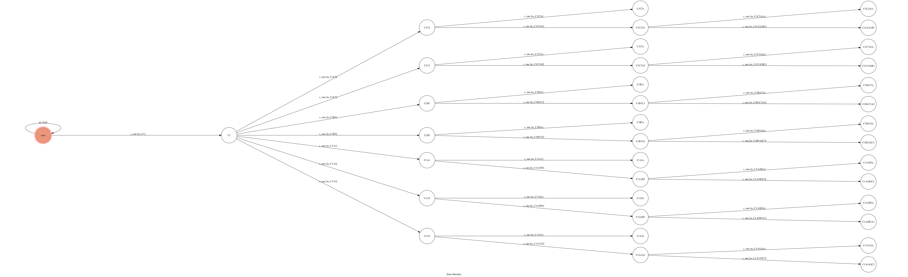
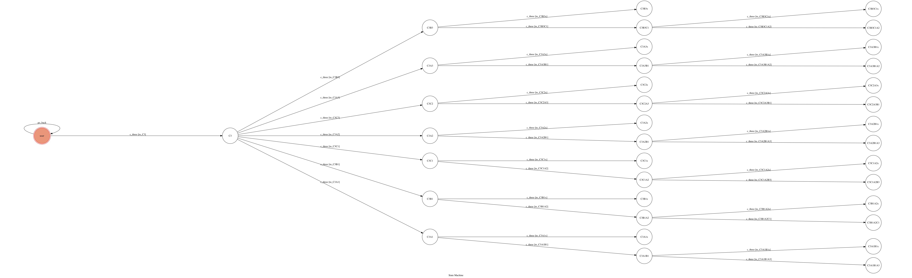

# Chat_Robot

## Usage
### Initial State : ```user```
*   user
    *   Input: A1
    *   Reply: 
    *      
         *   Input: B1
         *   Reply:
         *     
               *  Input: A3
               *  Reply:
               *     
                    *  Input: C2
                    *  Reply:
                    *      
                    *   平手

---
## Finite State Machine
### Remove back flow
   * A1
    
   * B1
    
   * C1
    
   * A2
    
   * B2
    
   * C2
    
   * A3
    
   * B3
    
   * C3
    


